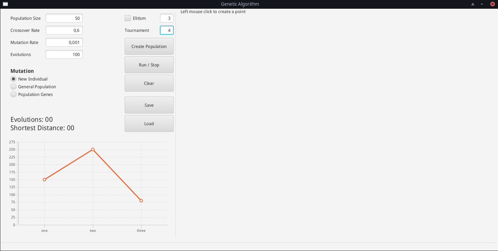
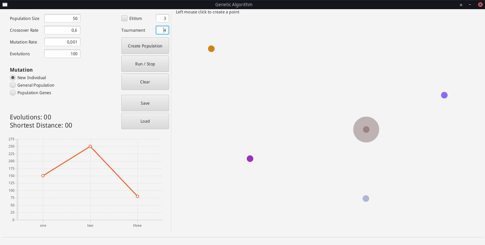

# Travelling Salesman problem using Genetic Algorithm

A simple application using Kotlin and TornadoFX library to propose a solution
to the travelling salesman problem using genetic algorithm.

## The application

    

<b>Application Main Window</b>
 
 

    

<b>To create points (Cities) use the left mouse button in the right area of the application</b>
 
 

## Setup

This application uses the TornadoFX library to create the user interface.
As Kotlin library, the TornadoFX needs the Java JDK 1.8 to compile.
Follow the [guide](https://edvin.gitbooks.io/tornadofx-guide/content/part1/2_Setting_Up.html)
on TornadoFX page to configure the complete environment for the library.

#### Building the application

This project uses Gradle to build the final application. There are some tasks you can
use to build the application:

1. distZip or distTar tasks to build the distribution version;
2. shadowJar to create a fat JAR file with application and dependencies;

